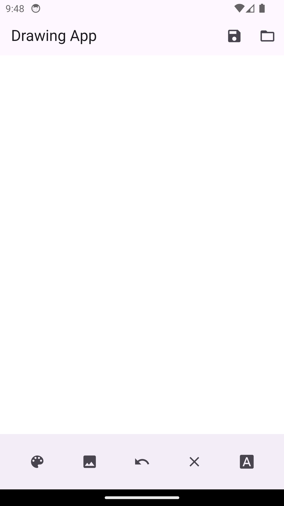
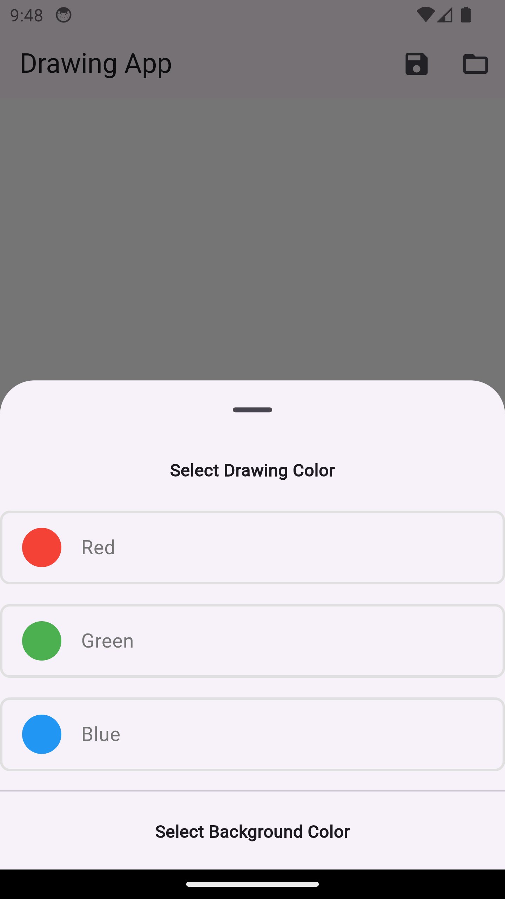
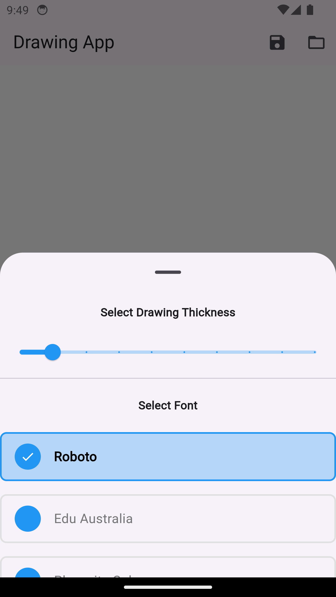
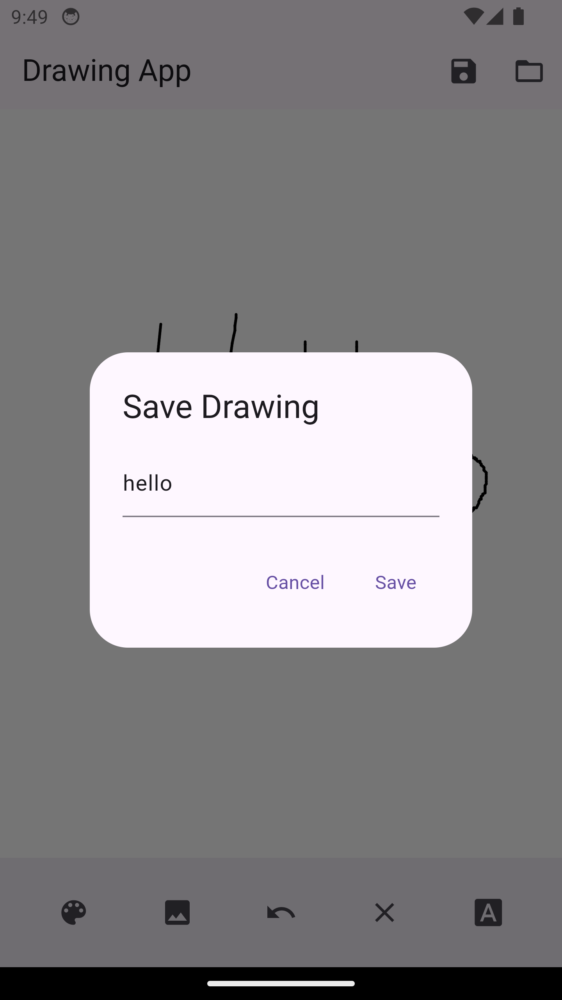
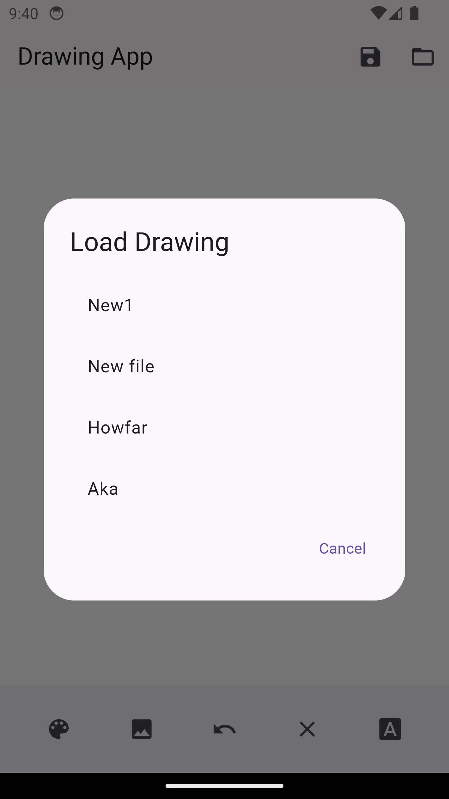

# Drawing App

A simple drawing application built with Flutter and Riverpod that allows users to draw on a canvas, select colors, choose fonts, and save or load their drawings.

## Features

- Draw lines on a canvas with customizable colors and thickness.
- Select from a variety of fonts.
- Save and load drawings as JSON files.
- Undo the last drawn line.
- Set a background color or image for the canvas.

## Video Demo

[](https://www.youtube.com/watch?v=yaYMX4bWkcA)


## Screenshots
<table>
  <tr>
    <td></td>
    <td></td>
    <td></td>
  </tr>
  <tr>
    <td></td>
    <td></td>
    <td></td>
  </tr>
</table>

## Getting Started

### Prerequisites

- Flutter SDK
- Dart SDK

## Installation

1. **Clone the repository:**
    ```bash
    git clone https://github.com/shadowalker001/drawing_app.git
    cd drawing_app
    ```

2. **Install dependencies:**
    ```bash
    flutter pub get
    ```

3. **Run the app:**
    ```bash
    flutter run
    ```

## Work Log

| Task                                              | Hours |
|---------------------------------------------------|-------|
| Initial Setup                                     | 1     |
| Implementing Canvas Drawing                       | 3     |
| Adding Color Change Functionality                 | 1     |
| Adding Background Color Change Functionality      | 1     |
| Adding Background Image Functionality             | 2     |
| Implementing Save and Load Functionality          | 2     |
| Adding Font Selection                             | 1     |
| Implementing Undo and Thickness Change            | 1     |
| Testing and Debugging                             | 2     |
| Documentation and Final Adjustments               | 1     |
| **Total**                                         | **15**|

## Feature Difficulty Ratings

| Feature                                                  | Difficulty | Explanation                                                                                          |
|----------------------------------------------------------|------------|------------------------------------------------------------------------------------------------------|
| Full-screen canvas for freehand drawing                  | Medium     | Required handling touch events and canvas rendering.                                                 |
| Change drawing color (at least three colors)             | Easy       | Straightforward implementation of color change functionality.                                        |
| Clear the canvas                                         | Easy       | Simple state reset functionality.                                                                    |
| Change the background color (at least three colors)      | Medium     | Required handling additional state and UI updates.                                                   |
| Change or add background pictures                        | Medium     | Required handling image selection and rendering.                                                     |
| Save drawings to edit later                              | Medium     | Required serialization and deserialization of drawing data.                                          |
| Load and edit saved drawings                             | Medium     | Similar complexity as saving functionality.                                                          |
| App should work in both portrait and landscape orientations | Medium | Required responsive design considerations.                                                           |
| Write beautifully with pre-selected fonts (at least three fonts) | Medium | Required font management and UI updates.                                                             |
| Undo the last drawn line (optional)                      | Medium     | Required maintaining a history of drawing actions.                                                   |
| Change the thickness of the drawing tool (optional)      | Easy       | Simple adjustment of drawing parameters.                                                             |


## Project Structure

```plaintext
lib
├── main.dart                 # Entry point of the application
├── models
│   └── draw_line.dart        # Model class for a drawn line
├── providers
│   └── drawing_provider.dart   # State management for drawing
├── screens
│   └── drawing_screen.dart   # Main screen for drawing
├── widgets
    ├── color_option.dart     # Widget for color selection
    ├── drawing_painter.dart  # Custom painter for drawing
    ├── font_option.dart      # Widget for font selection
    ├── load_dialog.dart      # Dialog for loading a drawing
    └── save_dialog.dart      # Dialog for saving a drawing
